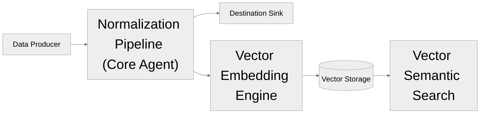

Each key architecture component; **Core Agent**, **Vector Embedding Engine**, **Vector Semantic Search** is designed with the high-performance, easy understanding and alot of configuration options available for users.

With this in mind, each component making up the VES platform can run independently in your stack whether or not you use the other components. This allows setting up and using only what fits your needs and avoid unnecessary overhead from components you might not need. See [this architecture](https://www.geeksforgeeks.org/system-design/pipe-and-filter-architecture-system-design/) to better understand what inspired our core architecture.

## Core Architecture

## What are the key features?

VES provides the following components:

- **Agent**: Parses, restructures, and enriches observability from different formats/sources into a uniform structure
- **Data Storage**: Observability data is stored in retrievable sinks, from third party provider integrations
- **Vector Embedding Engine**: Converts uniformly structured observability data from the agent into vectors (points in multi-dimensional space where similar data will be located closer together)
- **Vector Storage**: Vector data is stored in retrievable storage, from third party provider integrations
- **Vector Enhanced Search**: Observability data can be queried and retrieved semantically from vector storage

## Next steps

<CardGroup cols={2}>
    <Card title="Start using VES" icon="rocket" href="../ves-v0.1.0/getting-started">
        Install and run your first VES instance
    </Card>
    <Card title="Configuration Guides" icon="gear" href="../ves-v0.1.0/configuration">
        Learn about configuring VES
    </Card>
</CardGroup>
